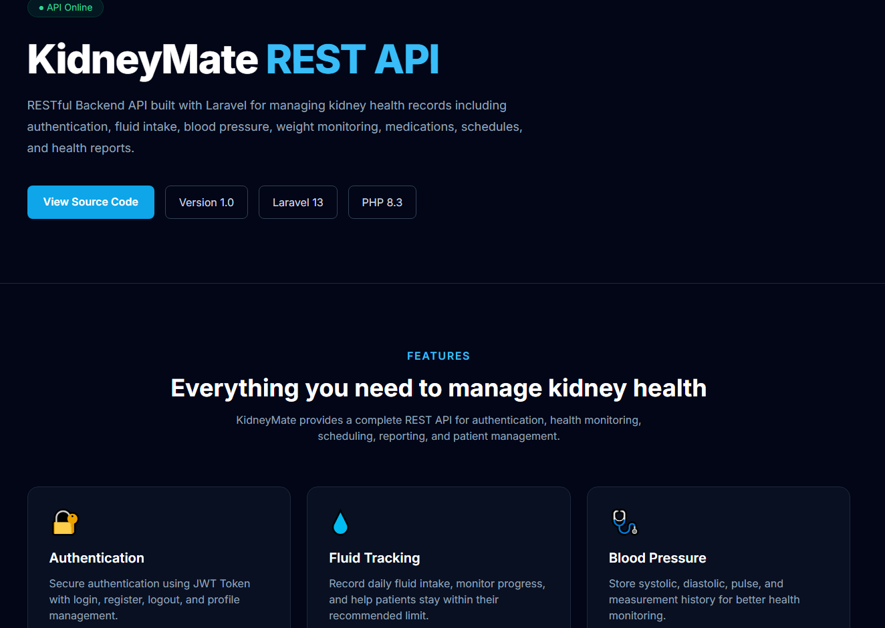

# KidneyMate Backend

RESTful Backend API built with Laravel for managing
kidney health records including authentication,
fluid intake, blood pressure, weight monitoring,
medications, schedules, and health reports.

---

## Tech Stack

[](https://laravel.com)
[](https://www.php.net/)
[](https://www.mysql.com/)
[](https://laravel.com/docs/eloquent)
[](https://restfulapi.net/)
[](https://getcomposer.org/)

---

## Preview

### Landing Page



---

### Authentication

- User Registration
- User Login
- User Logout
- Token-based Authentication using JWT
- Protected API Routes

### Health Management

- Fluid Intake Management
- Blood Pressure Records
- Weight Records
- Medication Management
- Scheduling

### Reports & Analytics

- Dashboard Summary API
- Health Insights API
- Monthly Health Reports API

### Account

- View Profile
- Update Profile
- Change Password

---

## Installation

Clone the repository

```bash
git clone https://github.com/yourFEdev/backend-kidneyMate.git
```

Move into the project

```bash
cd kidneymate-backend
```

Install dependencies

```bash
composer install
```

Copy the environment file

```bash
cp .env.example .env
```

Generate application key

```bash
php artisan key:generate
```

Configure your database inside the `.env` file.

Run migrations

```bash
php artisan migrate
```

Serve the application

```bash
php artisan serve
```

The API will be available at

```text
http://127.0.0.1:8000/api
```

---
